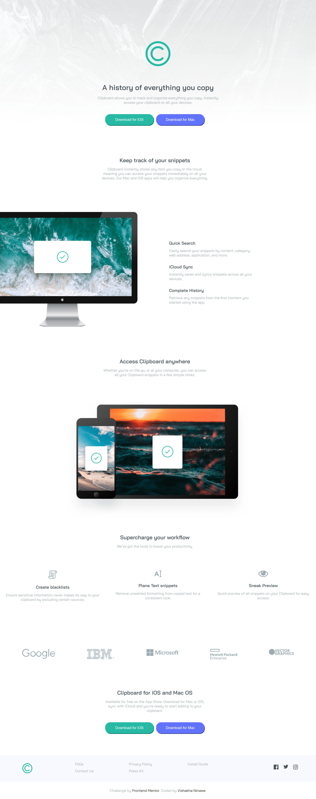
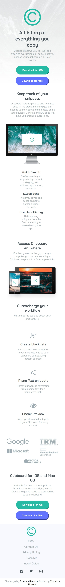

# Clipboard-landing-page
# Frontend Mentor - Clipboard landing page solution

This is a solution to the [Clipboard landing page challenge on Frontend Mentor](https://www.frontendmentor.io/challenges/clipboard-landing-page-5cc9bccd6c4c91111378ecb9). Frontend Mentor challenges help you improve your coding skills by building realistic projects. 

## Table of contents

- [Frontend Mentor - Clipboard landing page solution](#frontend-mentor---clipboard-landing-page-solution)
  - [Table of contents](#table-of-contents)
  - [Overview](#overview)
    - [The challenge](#the-challenge)
    - [Screenshot](#screenshot)
      - [Desktop View](#desktop-view)
      - [Mobile View](#mobile-view)
    - [Links](#links)
  - [My process](#my-process)
    - [Built with](#built-with)
    - [What I learned](#what-i-learned)
  - [Author](#author)


## Overview

### The challenge

Users should be able to:

- View the optimal layout for the site depending on their device's screen size
- See hover states for all interactive elements on the page

### Screenshot

#### Desktop View



#### Mobile View



### Links

- Solution URL: [Add solution URL here](https://your-solution-url.com)
- Live Site URL: [Add live site URL here](https://your-live-site-url.com)

## My process

### Built with

- Semantic HTML5 markup
- CSS custom properties
- Flexbox
- CSS Grid
- Mobile-first workflow


### What I learned


To see how you can add code snippets, see below:

```css
button:nth-of-type(1):hover {
    cursor: pointer;
  box-shadow: 0 5px 15px hsl(171, 100%, 24%);
}
button:nth-of-type(3):hover {
    cursor: pointer;
  box-shadow: 0 5px 15px hsl(171, 100%, 24%);
}
button:nth-of-type(2):hover {
    cursor: pointer;
  box-shadow: 0 5px 15px hsl(233, 46%, 39%);
}
button:nth-of-type(4):hover {
    cursor: pointer;
  box-shadow: 0 5px 15px hsl(233, 46%, 39%);
}

```

## Author

- Website - [Vishakha Ninawe](https://github.com/Vishakha-17)
- Frontend Mentor - [Vishakha-17](https://www.frontendmentor.io/profile/Vishakha-17)
- Twitter - [Vishakha76408997](https://twitter.com/Vishakh76408997)
